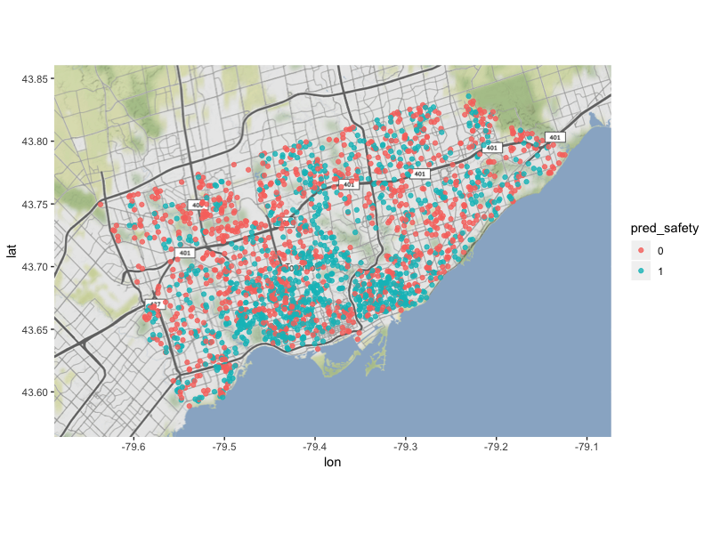

# Toronto Streetscore: Predicting Perceived Street Safety Using CNN

## Overview
This project aims to build an explainable machine learning model that could predict people's perceived safety towards Toronto streets views.
We apply deep Convolutional Neural Network (CNN) techniques on street view images fetched using Google Street View Static API.

Fig 1. Map of our models' final predictions of perceived safety on street view of 2034 Toronto geolocations.

## writeup/
* paper_street_safety.pdf    
Final project report.

* ppt_street_safety.pdf    
Final presentation slides.

## code/    

### Data Exploration:
* PlacePulse1.0_explore.ipynb   
Explores the data structure of the original data - PlacePulse1.0 used by the Streetscore project. 

* Streetscore_create_target_label.ipynb  
Generates a binary 'safety' label.
 
### Data Preparation:
* Boston_Stratified_Sampling.ipynb  
Stratified sampling 20,000 samples from the Boston data predicted by the Streetscore project considering two factors at the same time: 1). Portion of zone classes of Toronto and 2). Portion of Target “safety” variable.

* boston_split_train_test.ipynb  
Splits the downsampled 20,000 boston samples into 80 : 20 as training and test sets, so as to use the trainings and test sets to fetch images.

* fetchimage.py  
Fetches images using Google Street View Static API

*  cropimage.py  
Crops out the Google Logo on each image.

*  merge_fetched_train_test_image_with_target.ipynb  
Merges the fetched train / test images with target variable; Calculates fetched images' updated year.

*  Toronto_sample.ipynb  
Subsampled 2100 Toronto geolocations, with which fetched 2034 Toronto images. Those images would be used to deploy our final model for the predictions of Perceived Toronto Street View. 

### Model Building:

##### Transfer Learning:   
*  ResNeXt50ClassifierTemplate.py  
Generates a ResNeXt50 neural network with pretrained weights from Keras.

*  Classifier.py  
Trains the models using the pretrained weights, conducts 5-fold cross-validation, and save the 5 best models produced during cross-validation and 1 best model produced during the training on the full training data. 

*  ResNeXt_prediction.py  
Generates predictions by each of model on the test set. 

##### Building Self-Designed CNN: 
*  CNN_model1.ipynb    
Builds CNN model1 (with Boston Train Images as the training set), and predicts on Boston Test Images.

*  CNN_model2.ipynb    
Builds CNN model2 (with Boston Train and Test Images as the training set), and predicts on Toronto Images.

### Ensemble:
*  ensemble_boston_test.ipynb   
Conducts ensemble learning methods including: Averaging ensemble; Conditional ensemble; and Weighted ensemble; Calculates each model's confusion matrix and performance;  Finds one final model with relatively best prediction of both safety = 0 and safety =1.

*  ensemble_toronto.ipynb   
Applies the best ensemble strategy found in ensemble_boston_test.ipynb on Toronto images.
 
### Model Explanation:
*  Model interpretation generated using Lime package.ipynb   
Interprets model predictions using the LIME package.

*  CNN_Lime_interpretations.ipynb	   
Some qualitative analyses of LIME's interpretation of our models' predictions on Toronto street view images. 

### Visualization:
*  map_toronto_pred.R   
Visualizes our models' final predictions of perceived safety on the street view of 2034 Toronto geolocations.

## data/  

### Boston Data  

##### Data produced by target column generation:   
*  boston_safety.csv   
Boston data with a newly created target column - safety.

##### Data produced by stratified sampling:   
*  boston_safety_subsample.csv     
20000 downsampled Boston data samples, achieved by stratified sampling based on both the safety and the subdistrict columns.

##### Data produced by Train / Test split:   
*  boston_train_list.csv    
16000 Boston Train data samples (80% of the 20000) used to fetch Boston Train images.

*  boston_test_list.csv	    
4000 Boston Test data samples (20% of the 20000) used to fetch Boston Test images.

##### Data produced by image fetching:  
*  boston_train_metadata.json   
*  boston_test_metadata.json  
The json file created while fetching Boston Train and Test images using Google Street View Static API. It documents which images are successfully fetched and which are not, as well as the images' matadata such as the update date.

*  boston_train_fetched_with_target.csv	   
*  boston_test_fetched_with_target.csv	   
Boston Train and Test images fetched using Google Street View Static API (the above metadata.json files where status == 'okay'), merged with target column (safety).

##### Data produced by ensembling:   
*  final_pred_boston_test_weighted_ensemble2.csv	   
Final ensembled predictions on Boston Test images. 

### Toronto Data

##### Data produced by downsampling:   
*  Toronto2100_sample.csv    
2100 downsampled Toronto data samples used to fetch Toronto street view images.

##### Data produced by image fetching:   
*  toronto_metadata.json    
The json file created while fetching images using Google Street View Static API. It documents which images are successfully fetched and which are not, as well as the images' matadata such as the update date.

##### Data produced by ensembling:   
*  final_pred_toronto.csv	   
Final ensembled predictions on the Toronto street view images. 

##### Image produced by visualization:    
*  toronto_pred_800_600.png   
Map visualization of our models' final predictions of perceived safety on the street view of 2034 Toronto geolocations.

## models
Our models are available here: https://drive.google.com/drive/folders/1kTHfxkaQPnP62-EWS7aY1qPQs_qv4Xat

